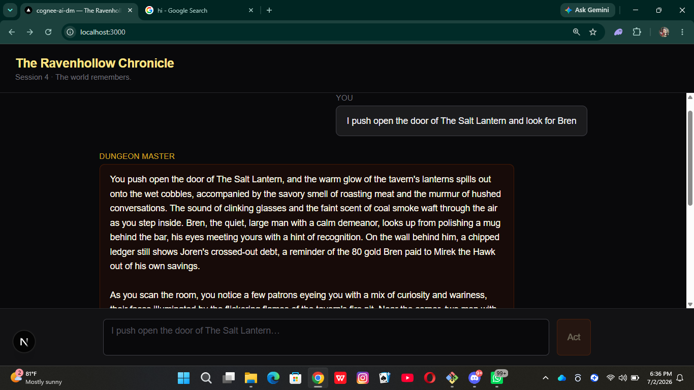
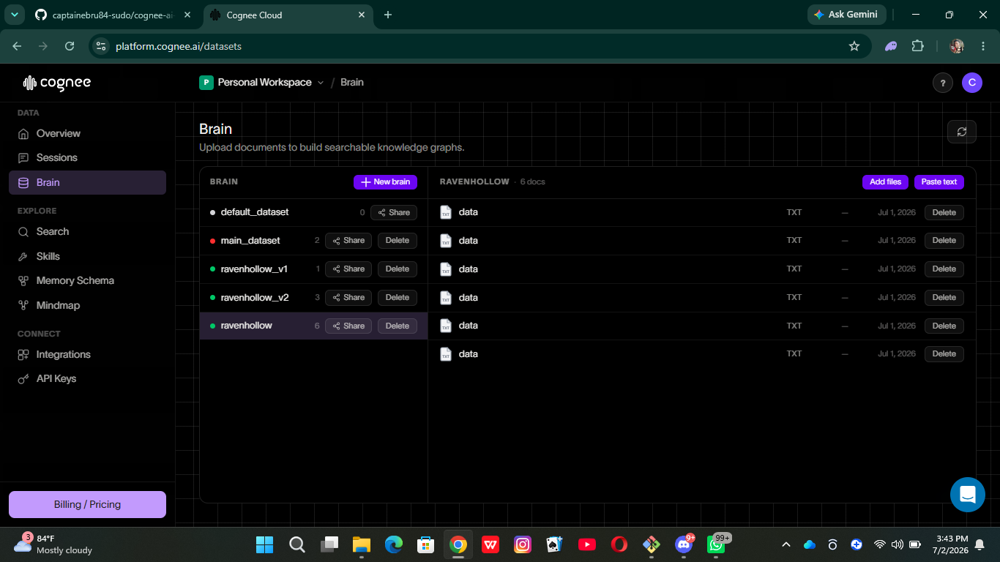
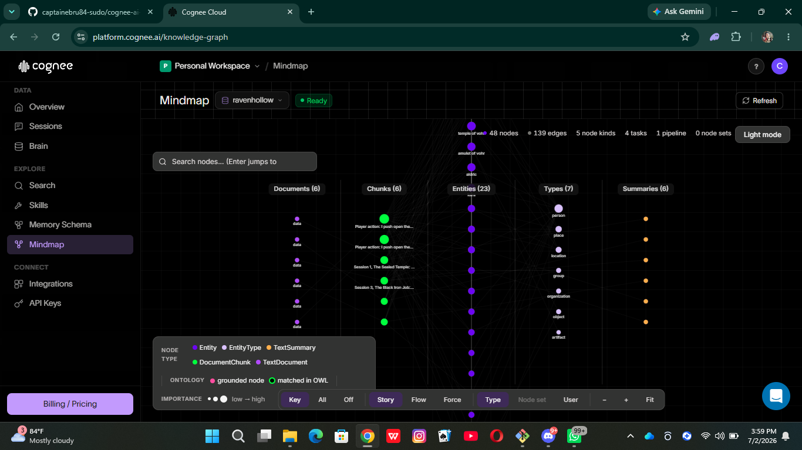

# cognee-ai-dm

**The world remembers.**

An AI Dungeon Master with persistent world memory, built on [Cognee](https://cognee.ai). NPCs remember what the party did three sessions ago. Locations reshape around past choices. The tavernkeeper's tone shifts when the players walk in — because he knows you betrayed his brother, and the graph remembers.

Built during the [Hangover Part AI](https://www.wemakedevs.org/hackathons/cognee) hackathon (Jun 29 – Jul 5, 2026).

---

## The demo

A real Session 4 turn in the chat UI — the player asks about Bren, and the GM name-drops **eight canon threads across three sessions**, none of which were in the prompt: Bren, Joren's paid-off debt, the 80 gold Bren paid to Mirek out of his own savings, Mirek the Hawk, Captain Vell + Ravenhollow Watch, Kara's scar, High Priestess Saerith, and the stolen Amulet of Vohr.



See [`demo_snapshot.txt`](demo_snapshot.txt) for a CLI-side variant of the same demo.

Twelve canon references in twelve sentences. The world remembers.

The graph itself, live on Cognee Cloud:

| Documents view | Knowledge graph |
|---|---|
|  |  |

Six ingested documents, extracted into a chunk/entity/type/summary graph.

---

## Quick start

**Requirements:** Python 3.11+, a Groq API key (free at [console.groq.com](https://console.groq.com)).

```bash
git clone https://github.com/captainebru84-sudo/cognee-ai-dm.git
cd cognee-ai-dm
python -m venv .venv
.venv/Scripts/activate      # or: source .venv/bin/activate on Unix
pip install cognee python-dotenv openai anthropic
```

Copy the env template and fill in your keys:

```bash
cp .env.example .env
# edit .env: paste your Groq key into LLM_API_KEY and NARRATION_API_KEY
```

### Local memory backend

Runs Cognee locally with fastembed embeddings — no cloud account needed.

```bash
python seed_world.py      # ingest Sessions 1-3 canon
python play.py            # interactive GM loop
```

### Cloud memory backend

Uses [Cognee Cloud](https://platform.cognee.ai) for the memory graph (redeem code `COGNEE-35` for $35 free credit at signup).

```bash
# in .env, set:
#   MEMORY_BACKEND=cloud
#   COGNEE_SERVICE_URL=<your tenant URL>
#   COGNEE_API_KEY=<your cloud key>
#   CLOUD_DATASET=ravenhollow

python seed_cloud.py      # push Sessions 1-3 to cloud tenant
python play.py            # same CLI, cloud-backed recall
```

The `MEMORY_BACKEND=local|cloud` env swap is the only code path difference. Same narration, same prompts, same loop.

---

## Repo tour

| File | What |
|---|---|
| `dm.py` | Core loop: `narrate(player_action)` — recall → GM prose → write-back |
| `prompts.py` | `NARRATION_SYSTEM_PROMPT` with the Canon Density Rule (≥3 canon refs / narration) |
| `canon.py` | Ravenhollow Chronicle Sessions 1-3 seed strings |
| `play.py` | Interactive CLI driver |
| `seed_world.py` | One-shot local ingest |
| `seed_cloud.py` | One-shot Cognee Cloud ingest |
| `day1_smoke.py` | End-to-end smoke: single turn, prints narration |
| `day2_smoke.py` | Canon-reference scoring against 12 keywords |
| `day2_recall_probe.py` | Diagnostic: 7 SearchTypes × raw vs rewritten query |
| `day3_cloud_smoke.py` | Cloud-backed smoke, scores canon hits |
| `demo_snapshot.txt` | Session 4 canonical narration output |

---

## Stack

- **Memory:** [Cognee](https://cognee.ai) 1.2.x — hybrid graph + vector recall
- **Cognee's internal LLM:** Groq `llama-3.3-70b-versatile` via `LLMProvider.CUSTOM`
- **Cognee's embeddings:** local [fastembed](https://github.com/qdrant/fastembed) with `BAAI/bge-small-en-v1.5`
- **Narration LLM:** Groq `llama-3.3-70b-versatile` (swap via `NARRATION_PROVIDER=anthropic` for Claude)
- **Cloud backend (optional):** Cognee Cloud

---

## The design choice that made recall work

Player declarations aren't queries. If you pass `"I push open the door of The Salt Lantern..."` straight to `cognee.recall()`, the GRAPH_COMPLETION path reads it as an instruction to the LLM and returns `"Got it."` — zero canon.

`dm.py` rewrites the player action into an entity-dense recall question naming every cast member and location before hitting the graph. Cognee's traversal filters to only the nodes that matter for the current scene, so over-naming up front is free. This single change took canon hits from 1/12 to 12/12 in local mode.

See `WORLD_CAST_FOR_QUERY` in `dm.py` and the `day2_recall_probe.py` diagnostic that proved this out.

---

## AI assistance disclosure

This project was built with AI assistance (Claude Code) per the hackathon rules. Human decisions include: the pitch, the Ravenhollow Chronicle canon, the design of the demo moment (return-to-tavern with three simultaneous recall chains), and the choice to add the entity-dense recall rewriter after inspecting Cognee's `GRAPH_COMPLETION` behavior directly. Code was co-authored.

---

## License

MIT.
